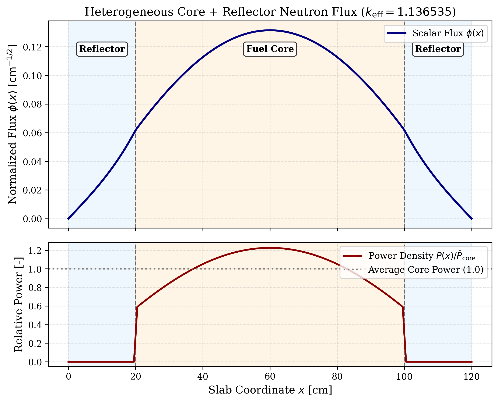
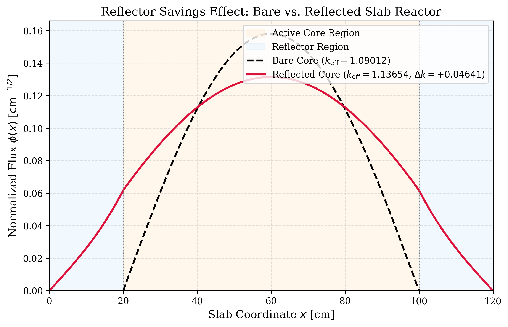
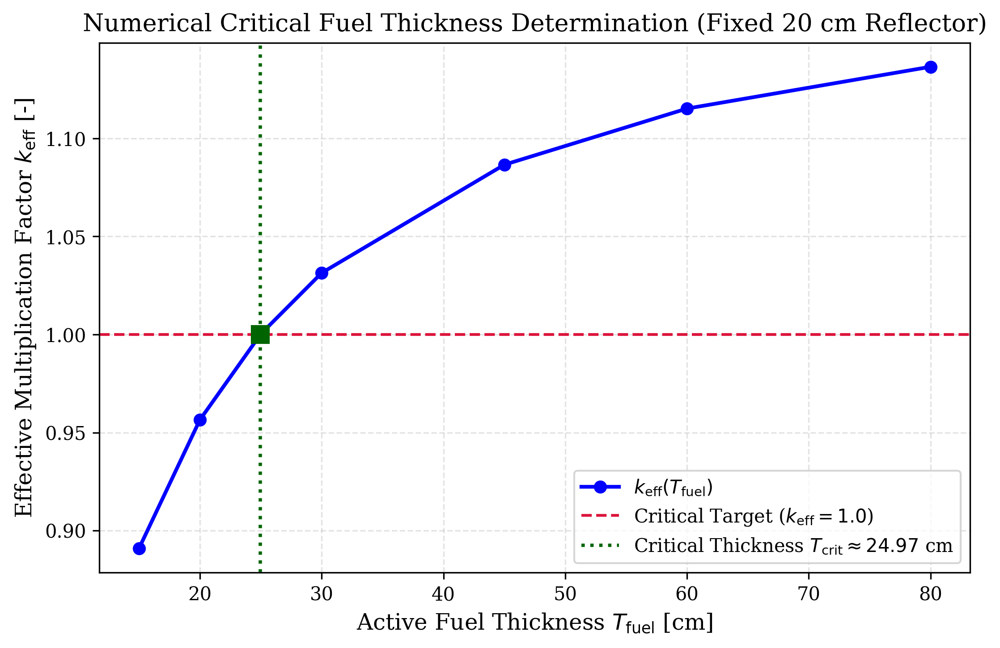
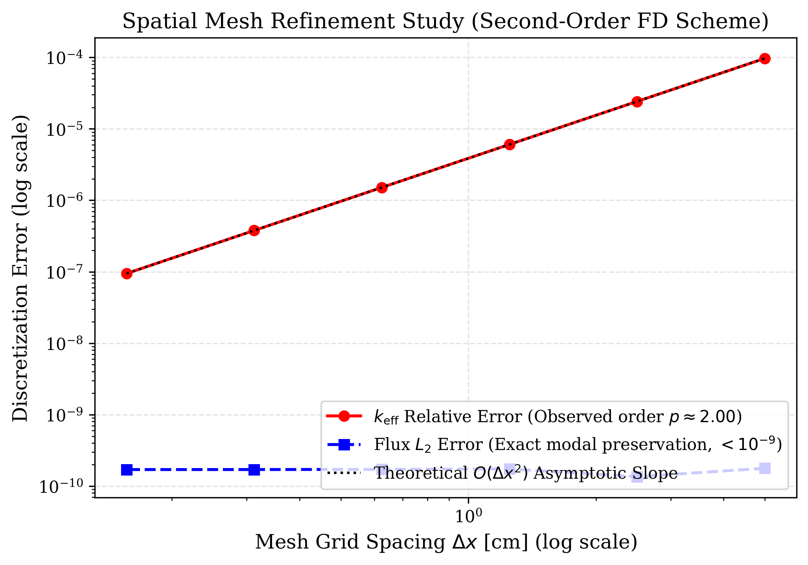

# 1D Neutron Diffusion Reactor Simulator

[](LICENSE)
[](https://www.python.org/downloads/)
[](https://github.com/psf/black)

A modular, research-oriented computational reactor-physics framework solving the steady-state, one-energy-group neutron diffusion eigenvalue problem for both homogeneous and multi-region heterogeneous reflected reactor cores in 1D slab geometry.

- **What it is**: A transparent scientific computing laboratory implementing conservative second-order finite-difference discretization, harmonic interface diffusion coefficients, an $\mathcal{O}(N)$ Thomas algorithm (TDMA), and power iteration to determine the fundamental effective multiplication factor ($k_{\text{eff}}$), spatial scalar neutron flux ($\phi(x)$), and core fission power distribution ($P(x)$).
- **What it demonstrates**: Exact analytical benchmark verification ($< 0.5\text{ pcm}$ error), asymptotic second-order spatial mesh convergence ($\mathcal{O}(\Delta x^2)$), multi-region core-reflector interface physics, reflector savings ($\Delta k > 0$), core flux/power flattening, and robust numerical critical fuel sizing ($T_{\text{crit}}$).
- **Why it is interesting**: The simulator progresses logically from an analytically verifiable homogeneous slab benchmark to a multi-region heterogeneous core-reflector system with discontinuous cross sections, providing an accessible yet mathematically rigorous bridge between introductory reactor theory and modern computational methods.

---

## Key Results

Below is a summary of the headline computational results produced by the framework's canonical baseline and heterogeneous core/reflector models:

| Quantity | Computational Result | Physical Context / Benchmark Description |
| :--- | :---: | :--- |
| **Bare-Core Eigenvalue ($k_{\text{eff}}$)** | `1.09012419` | $80.0\text{ cm}$ active fuel core with vacuum boundary conditions ($\phi=0$) |
| **Reflected-Core Eigenvalue ($k_{\text{eff}}$)** | `1.13653540` | Identical $80.0\text{ cm}$ core flanked symmetrically by $20.0\text{ cm}$ reflectors |
| **Reflector Savings ($\Delta k$)** | `+0.04641121` | **$+4641.1\text{ pcm}$** reactivity gain from reduced leakage and return of diffusing neutrons |
| **Core Power Flattening** | `22.0% reduction` | Peak-to-average power ratio ($P_{\text{peak}}/\bar{P}$) drops from $1.5708$ to $1.2251$ |
| **Critical Fuel Thickness ($T_{\text{crit}}$)** | `24.9658 cm` | Numerical root of discrete heterogeneous model with $20.0\text{ cm}$ reflectors |
| **Criticality Verification ($k_{\text{eff}}(T_{\text{crit}})$)** | `0.99999873` | Residual $\lvert k_{\text{eff}} - 1.0 \rvert = 1.27 \times 10^{-6}$ ($0.13\text{ pcm}$ from exact critical) |
| **Homogeneous Analytical Benchmark** | `1.19121585` | Closed-form exact solution: $k_{\text{eff}} = \nu\Sigma_f / (\Sigma_a + D B_g^2)$ |
| **Homogeneous Discretization Error** | `+4.41e-06` | Numerical eigenvalue discrepancy of only **$0.44\text{ pcm}$** ($N=100$, $\Delta x = 1.0\text{ cm}$) |
| **Spatial Convergence Order ($p$)** | `p = 2.000` | Asymptotic rate fitted over $N \in [20, 640]$ cells ($R^2 = 1.0000$, matches $\mathcal{O}(\Delta x^2)$) |
| **Automated Verification Tests** | `45 / 45 passing` | 100% test pass rate across 12 automated verification test modules |

*(Note: These values reflect the project's illustrative computational models and are strictly reproducible via the included CLI and test suite).*

### Primary Scientific Figures

#### Heterogeneous Core-Reflector Flux & Power Distribution

*Figure 1: Numerical scalar neutron flux $\phi(x)$ (top panel) and normalized fission power density $P(x)$ (bottom panel) across the symmetric reflected core ($20\text{ cm}$ reflector, $80\text{ cm}$ fuel, $20\text{ cm}$ reflector). The non-multiplying reflectors scatter escaping neutrons back into the core, elevating peripheral flux and reducing peak-to-average core power concentration from $1.571$ to $1.225$.*

#### Reflector Savings: Bare vs. Reflected Reactor

*Figure 2: Controlled comparison of an identical $80\text{ cm}$ active fuel core with and without reflector regions. Adding a $20\text{ cm}$ heavy-water/graphite reflector increases the fundamental eigenvalue from $1.09012$ to $1.13654$ ($\Delta k = +0.04641$, $+4641.1\text{ pcm}$), shifting the assembly from subcritical to supercritical solely through leakage reduction.*

#### Numerical Critical Fuel Core Sizing

*Figure 3: Numerical determination of the critical fuel core thickness $T_{\text{crit}}$ for a fixed $20\text{ cm}$ reflector. Parameter sweep (markers) establishes strict monotonicity, and bisection root-finding determines $T_{\text{crit}} = 24.9658\text{ cm}$ with a direct evaluation of $k_{\text{eff}}(T_{\text{crit}}) = 0.99999873$ ($|k_{\text{eff}} - 1.0| = 0.13\text{ pcm}$).*

#### Second-Order Spatial Mesh Convergence

*Figure 4: Asymptotic spatial mesh refinement analysis over grid resolutions $N \in [20, 640]$ ($\Delta x \in [0.156, 5.0]\text{ cm}$). Log-log linear regression confirms an observed spatial convergence order of $p = 2.000$ ($R^2 = 1.0000$) for the fundamental eigenvalue, confirming the theoretical $\mathcal{O}(\Delta x^2)$ accuracy of the central finite-difference operator.*

---

## Table of Contents

1. [Key Results](#key-results)
2. [Scientific Objective & Motivation](#1-scientific-objective--motivation)
3. [Physical Model & Governing Equations](#2-physical-model--governing-equations)
4. [Boundary Conditions](#3-boundary-conditions)
5. [Analytical Verification Benchmark](#4-analytical-verification-benchmark)
6. [Numerical Discretization & Operators](#5-numerical-discretization--operators)
7. [Power Iteration Algorithm](#6-power-iteration-algorithm)
8. [Verification & Mesh Convergence Study](#7-verification--mesh-convergence-study)
9. [Reactor Physics Parameter Sensitivity Analysis](#8-reactor-physics-parameter-sensitivity-analysis)
10. [Flux and Power Distributions](#9-flux-and-power-distributions)
11. [Version 2: Heterogeneous Core and Reflector Model](#10-version-2-heterogeneous-core-and-reflector-model)
12. [Generated Publication Figures](#11-generated-publication-figures)
13. [Project Architecture & Design](#12-project-architecture--design)
14. [Installation & Reproduction Instructions](#13-installation--reproduction-instructions)
15. [CLI Usage](#14-cli-usage)
16. [Automated Verification Test Suite](#15-automated-verification-test-suite)
17. [Scope & Limitations](#16-scope--limitations)
19. [References](#18-references)
20. [Citation](#19-citation)
21. [License](#20-license)


---

## 1. Scientific Objective & Motivation

The fundamental eigenvalue problem in nuclear reactor physics governs the steady-state neutron balance of a critical assembly. Accurately determining the effective neutron multiplication factor ($k_{\text{eff}}$), the spatial scalar neutron flux distribution ($\phi(x)$), and the fission power density ($P(x)$) is the cornerstone of reactor core design, fuel management, and safety analysis.

This project implements a transparent, self-contained computational laboratory designed to:
- Formulate the one-energy-group neutron diffusion eigenvalue problem from first principles.
- Discretize the spatial leakage and absorption operators using a conservative second-order finite difference scheme.
- Invert the fixed-source diffusion operator efficiently in $\mathcal{O}(N)$ operations using the tridiagonal Thomas algorithm (TDMA).
- Solve the non-linear generalized eigenvalue problem using an outer power iteration procedure.
- Rigorously verify numerical predictions against exact analytical closed-form solutions for bare homogeneous slab reactors.
- Quantify spatial truncation errors through systematic mesh refinement to establish the asymptotic order of convergence.
- Investigate core physical response to macroscopic cross-section and geometric parameter variations.

This code is scoped as an educational and research computational prototype demonstrating scientific computing best practices in computational reactor physics.

---

## 2. Physical Model & Governing Equations

In large multiplying media with isotropic scattering, the energy-integrated, angular-integrated steady-state neutron balance is described by the 1D one-group neutron diffusion equation:

$$-D \frac{d^2\phi(x)}{dx^2} + \Sigma_a \phi(x) = \frac{1}{k_{\text{eff}}} \nu\Sigma_f \phi(x), \quad x \in [0, L]$$

where:
- $\phi(x)$ is the scalar neutron flux [$\text{cm}^{-2}\,\text{s}^{-1}$].
- $D$ is the neutron diffusion coefficient [$\text{cm}$], defined from the transport cross section as $D = \frac{1}{3 \Sigma_{\text{tr}}}$.
- $\Sigma_a$ is the macroscopic absorption cross section [$\text{cm}^{-1}$].
- $\nu\Sigma_f$ is the macroscopic fission neutron production cross section [$\text{cm}^{-1}$], representing the product of the average number of neutrons emitted per fission ($\nu$) and the fission cross section ($\Sigma_f$).
- $k_{\text{eff}}$ is the effective multiplication factor (the dominant eigenvalue of the system).
- $L$ is the physical thickness of the homogeneous core slab [$\text{cm}$].

### Physical Interpretation of Terms
- $-D \frac{d^2\phi}{dx^2}$: Spatial neutron leakage rate per unit volume via Fick's Law ($J = -D \frac{d\phi}{dx}$).
- $\Sigma_a \phi$: Neutron loss rate per unit volume through capture and fission absorption.
- $\nu\Sigma_f \phi$: Total prompt and delayed neutron generation rate per unit volume from fission reactions.
- $k_{\text{eff}}$: The scaling factor required to balance production against total destruction (leakage + absorption). If $k_{\text{eff}} = 1.0$, the assembly is critical; if $k_{\text{eff}} > 1.0$, supercritical; if $k_{\text{eff}} < 1.0$, subcritical.

---

## 3. Boundary Conditions

At the outer boundaries of a bare, unreflected reactor core, neutrons escape into the surrounding vacuum without re-entering. In diffusion theory, this is modeled by setting the neutron flux to zero at the core boundaries:

$$\phi(0) = 0, \quad \phi(L) = 0$$

*(Note: In rigorous transport theory, the flux vanishes at extrapolated boundaries $x = -d$ and $x = L + d$, where $d \approx 0.7104 \lambda_{\text{tr}}$. For this analytical reference benchmark, the zero-flux boundary is placed directly at the slab boundaries $0$ and $L$ without loss of generality).*

---

## 4. Analytical Verification Benchmark

For a homogeneous slab with spatially constant cross sections and zero Dirichlet boundary conditions, the fundamental spatial eigenmode is the sine function:

$$\phi_1(x) = \sin\left(\frac{\pi x}{L}\right)$$

Evaluating the second spatial derivative yields:

$$\frac{d^2\phi_1}{dx^2} = -\left(\frac{\pi}{L}\right)^2 \sin\left(\frac{\pi x}{L}\right) = -B_g^2 \phi_1(x)$$

where the geometric buckling of the fundamental mode is:

$$B_g^2 = \left(\frac{\pi}{L}\right)^2$$

Substituting this eigenmode back into the governing diffusion equation:

$$D B_g^2 \phi_1(x) + \Sigma_a \phi_1(x) = \frac{1}{k_{\text{eff}}} \nu\Sigma_f \phi_1(x)$$

Dividing through by $\phi_1(x) \ne 0$ gives the exact analytical fundamental eigenvalue:

$$k_{\text{eff,analytical}} = \frac{\nu\Sigma_f}{\Sigma_a + D B_g^2}$$

### Baseline Model Parameters

The benchmark problem uses physically realistic thermal reactor parameters for a bare homogeneous core slab:

| Parameter | Symbol | Baseline Value | Units |
| :--- | :---: | :---: | :---: |
| Slab Core Thickness | $L$ | $100.0$ | $\text{cm}$ |
| Diffusion Coefficient | $D$ | $1.0$ | $\text{cm}$ |
| Macroscopic Absorption Cross Section | $\Sigma_a$ | $0.020$ | $\text{cm}^{-1}$ |
| Fission Production Cross Section | $\nu\Sigma_f$ | $0.025$ | $\text{cm}^{-1}$ |
| Thermal Diffusion Length | $L_d = \sqrt{D / \Sigma_a}$ | $7.0711$ | $\text{cm}$ |
| Infinite Multiplication Factor | $k_\infty = \nu\Sigma_f / \Sigma_a$ | $1.2500$ | $-$ |
| Geometric Buckling | $B_g^2 = (\pi / L)^2$ | $9.8696044 \times 10^{-4}$ | $\text{cm}^{-2}$ |

Substituting these baseline parameters into the single-fraction analytical formula:

$$k_{\text{eff,analytical}} = \frac{0.025}{0.02 + 1.0 \times 9.8696044 \times 10^{-4}} = \frac{0.025}{0.02098696044} \approx 1.19121585$$

### Exact Criticality Condition

To achieve exact criticality ($k_{\text{eff}} = 1.0$), production must balance absorption plus leakage:

$$\frac{\nu\Sigma_f}{\Sigma_a + D B_g^2} = 1.0 \implies \nu\Sigma_{f,\text{crit}} = \Sigma_a + D B_g^2$$

For the baseline core geometry, the critical cross section is:

$$\nu\Sigma_{f,\text{crit}} = 0.02 + 1.0 \times 9.8696044 \times 10^{-4} \approx 0.0209869604\text{ cm}^{-1}$$

---

## 5. Numerical Discretization & Operators

The domain $[0, L]$ is discretized into $N$ uniform cells of width $\Delta x = L / N$, with nodal coordinates $x_i = i \Delta x$ for $i = 0, 1, \dots, N$. The unknown values are the $N-1$ interior nodes $\boldsymbol{\phi} = [\phi_1, \phi_2, \dots, \phi_{N-1}]^T$.

Applying second-order central differences:

$$-D \left[\frac{\phi_{i-1} - 2\phi_i + \phi_{i+1}}{\Delta x^2}\right] + \Sigma_a \phi_i = \frac{1}{k_{\text{eff}}} \nu\Sigma_f \phi_i$$

In matrix form:

$$\mathbf{A} \boldsymbol{\phi} = \frac{1}{k_{\text{eff}}} \mathbf{F} \boldsymbol{\phi}$$

### Structure and Properties of Discrete Operator $\mathbf{A}$
The loss operator $\mathbf{A} \in \mathbb{R}^{(N-1)\times(N-1)}$ is tridiagonal:
- **Main diagonal**: $A_{i,i} = \frac{2D}{\Delta x^2} + \Sigma_a$
- **Sub-diagonal**: $A_{i, i-1} = -\frac{D}{\Delta x^2}$
- **Super-diagonal**: $A_{i, i+1} = -\frac{D}{\Delta x^2}$

$\mathbf{A}$ satisfies:
1. **Symmetry**: $\mathbf{A} = \mathbf{A}^T$.
2. **Strict Diagonal Dominance**: $|A_{i,i}| = \frac{2D}{\Delta x^2} + \Sigma_a > \sum_{j \ne i} |A_{i,j}| = \frac{2D}{\Delta x^2}$ for $\Sigma_a > 0$.
3. **Positive Definiteness**: All eigenvalues are strictly positive.
4. **M-Matrix Property & Inverse Positivity**: The discretized diffusion-loss operator has M-matrix properties under the stated assumptions, supporting a non-negative response to a non-negative source. Perron-Frobenius theory is relevant separately to the dominant eigenvalue/eigenvector structure of the non-negative multiplication operator.

### The Thomas Algorithm (TDMA)
Rather than using general matrix factorization ($\mathcal{O}(N^3)$), the tridiagonal fixed-source equation $\mathbf{A} \boldsymbol{\phi} = \mathbf{s}$ is solved using the Thomas algorithm in $\mathcal{O}(N)$ operations. Because the discrete loss matrix $\mathbf{A}$ is symmetric, tridiagonal, and strictly diagonally dominant for $\Sigma_a > 0$, standard Gaussian elimination without pivoting (the Thomas algorithm) proceeds without breakdown or loss of precision.

---

## 6. Power Iteration Algorithm

Power iteration is the classic reactor physics technique for finding the dominant eigenvalue ($k_{\text{eff}}$) and fundamental eigenmode ($\boldsymbol{\phi}$).

```
Initialize:
  phi^(0) = [1, 1, ..., 1]^T (normalized)
  k^(0)   = 1.0
  m       = 0

Iterate:
  1. Compute fission source vector:
     s^(m) = (1 / k^(m)) * nuSigma_f * phi^(m)

  2. Solve tridiagonal system for candidate flux:
     A * phi_tilde^(m+1) = s^(m)   [via Thomas Algorithm]

  3. Compute updated fission production:
     P^(m+1) = \int_0^L \nu\Sigma_f \phi_tilde^(m+1) dx
     P^(m)   = \int_0^L \nu\Sigma_f phi^(m) dx

  4. Update multiplication factor:
     k^(m+1) = k^(m) * (P^(m+1) / P^(m))

  5. Normalize candidate flux:
     phi^(m+1) = phi_tilde^(m+1) / ||phi_tilde^(m+1)||_{L2}

  6. Convergence check:
     |k^(m+1) - k^(m)| < tol_k  AND  ||phi^(m+1) - phi^(m)||_2 / ||phi^(m+1)||_2 < tol_flux
```

---

## 7. Verification & Mesh Convergence Study

### Baseline Numerical Results ($N = 100$, $\Delta x = 1.0\text{ cm}$)

The baseline simulation was executed and compared against the analytical benchmark:

| Metric | Analytical Benchmark | Numerical Simulation | Discrepancy |
| :--- | :---: | :---: | :---: |
| Effective Multiplication Factor ($k_{\text{eff}}$) | $1.19121585$ | $1.19122027$ | $+4.41 \times 10^{-6}$ ($0.44\text{ pcm}$) |
| Fundamental Flux Profile | $\sqrt{2/L}\sin(\pi x / L)$ | Discretized Central FD | $L_2$ Rel Err: $1.31 \times 10^{-6}$ |
| Outer Power Iterations | $-$ | $39$ iterations | Converged ($\text{tol}_k = 10^{-7}$) |
| Wall-Clock Solution Time | $-$ | $0.0296\text{ s}$ | High computational efficiency |

### Systematic Mesh Refinement Study

Spatial mesh refinement was conducted across six grid resolutions ($N \in [20, 40, 80, 160, 320, 640]$):

| Mesh Cells ($N$) | Grid Spacing $\Delta x$ [cm] | Numerical $k_{\text{eff}}$ | Relative Error in $k_{\text{eff}}$ | Flux $L_2$ Error | Iterations | Runtime [s] |
| :---: | :---: | :---: | :---: | :---: | :---: | :---: |
| $20$ | $5.0000$ | $1.19133096$ | $9.6626 \times 10^{-5}$ | $1.78 \times 10^{-10}$ | $44$ | $0.0076$ |
| $40$ | $2.5000$ | $1.19124465$ | $2.4170 \times 10^{-5}$ | $1.35 \times 10^{-10}$ | $44$ | $0.0125$ |
| $80$ | $1.2500$ | $1.19122305$ | $6.0432 \times 10^{-6}$ | $1.74 \times 10^{-10}$ | $44$ | $0.0248$ |
| $160$ | $0.6250$ | $1.19121765$ | $1.5108 \times 10^{-6}$ | $1.71 \times 10^{-10}$ | $44$ | $0.0465$ |
| $320$ | $0.3125$ | $1.19121630$ | $3.7770 \times 10^{-7}$ | $1.70 \times 10^{-10}$ | $44$ | $0.0886$ |
| $640$ | $0.1562$ | $1.19121597$ | $9.4409 \times 10^{-8}$ | $1.70 \times 10^{-10}$ | $44$ | $0.1742$ |

### Observed Convergence Order
Fitting the error model $\text{Error} = C (\Delta x)^p$ yields:
- **Observed $k_{\text{eff}}$ Order of Convergence**: $p = 2.000$ ($R^2 = 1.0000$).
- **Theoretical Expectation**: Second-order central difference discretization yields $\mathcal{O}(\Delta x^2)$. The observed order of $2.000$ matches theory with high precision.
- **Nodal Flux Shape Preservation**: On a uniform mesh with zero Dirichlet conditions, the discrete central difference operator preserves the exact spatial harmonic eigenmode $\sin(\pi x_j / L)$ without modal contamination, bounding the nodal flux error by the power iteration tolerance ($\sim 10^{-10}$).

---

## 8. Reactor Physics Parameter Sensitivity Analysis

Parametric sensitivity sweeps demonstrate core neutronic response:

1. **Core Size ($L \in [30, 300]\text{ cm}$)**:
   As slab thickness increases, geometric buckling $B_g^2 = (\pi / L)^2$ decreases towards zero. Neutron leakage drops dramatically, driving $k_{\text{eff}}$ upwards asymptotically toward $k_\infty = 1.250$.
2. **Absorption Cross Section ($\Sigma_a \in [0.010, 0.035]\text{ cm}^{-1}$)**:
   Increasing macroscopic absorption increases parasitic non-fission and fission captures, directly reducing the multiplication factor.
3. **Diffusion Coefficient ($D \in [0.5, 2.0]\text{ cm}$)**:
   A larger diffusion coefficient enhances neutron streaming toward the vacuum boundaries, increasing leakage and lowering $k_{\text{eff}}$.
4. **Neutron Production ($\nu\Sigma_f \in [0.018, 0.032]\text{ cm}^{-1}$)**:
   The eigenvalue $k_{\text{eff}}$ scales linearly with $\nu\Sigma_f$, confirming the theoretical relation $k_{\text{eff}} \propto \nu\Sigma_f$.

---

## 9. Flux and Power Distributions

In a one-group homogeneous reactor core, the fission power density is:

$$P(x) = E_f \Sigma_f \phi(x)$$

Because $\Sigma_f$ is spatially constant, the relative power distribution $P(x) / \bar{P}$ follows the scalar flux shape:

$$P_{\text{rel}}(x) = \frac{\pi}{2} \sin\left(\frac{\pi x}{L}\right)$$

The peak-to-average power ratio for a 1D bare homogeneous slab is:

$$\frac{P_{\text{peak}}}{\bar{P}} = \frac{\pi}{2} \approx 1.5708$$

---

## 10. Version 2: Heterogeneous Core and Reflector Model

Building on the verified homogeneous analytical baseline, Version 2 introduces a research-oriented computational model for heterogeneous one-dimensional neutron diffusion to investigate spatial interface neutronics, reflector savings, and critical fuel dimensions.

### 10.1 Physical Motivation & Core-Reflector Systems

Bare homogeneous reactors suffer from heavy neutron leakage at the periphery, which depresses reactivity, demands higher fissile fuel inventories, and creates severe spatial flux gradients with a high peak-to-average power ratio ($P_{\text{peak}}/\bar{P} \approx 1.57$).

In practical reactor design, the active multiplying core is surrounded by an external **reflector**—a non-multiplying ($\nu\Sigma_f = 0$), low-absorbing, high-scattering material (e.g., light water, heavy water, graphite, or beryllium). The reflector scatters escaping neutrons back into the core, yielding two major engineering advantages:
1. **Reflector Savings ($\Delta k > 0$)**: Lowering overall net leakage increases system reactivity, allowing smaller core volumes or reduced fuel enrichment.
2. **Flux & Power Flattening**: Raising peripheral neutron flux elevates power generation at the core edges, lowering peak-to-average power density and enhancing thermal-hydraulic margins.

### 10.2 Mathematical Formulation & Multi-Region Piecewise Model

The 1D multi-region steady-state neutron diffusion equation across domain $[0, L_{\text{tot}}]$ is:

$$-\frac{d}{dx}\left(D(x) \frac{d\phi(x)}{dx}\right) + \Sigma_a(x)\phi(x) = \frac{1}{k_{\text{eff}}} \nu\Sigma_f(x)\phi(x)$$

The domain is partitioned into $M$ contiguous subregions $\Omega_m = [x_{m-1}, x_m]$, where within each region $m$, the macroscopic parameters $(D_m, \Sigma_{a,m}, \nu\Sigma_{f,m})$ are uniform.

For a symmetric reflected reactor of total thickness $L_{\text{tot}} = 2 T_{\text{refl}} + T_{\text{fuel}}$:
- **Left Reflector**: $x \in [0, T_{\text{refl}}]$ with $(D_{\text{refl}}, \Sigma_{a,\text{refl}}, \nu\Sigma_{f,\text{refl}} = 0)$
- **Central Core (Fuel)**: $x \in [T_{\text{refl}}, T_{\text{refl}} + T_{\text{fuel}}]$ with $(D_{\text{fuel}}, \Sigma_{a,\text{fuel}}, \nu\Sigma_{f,\text{fuel}} > 0)$
- **Right Reflector**: $x \in [T_{\text{refl}} + T_{\text{fuel}}, L_{\text{tot}}]$ with $(D_{\text{refl}}, \Sigma_{a,\text{refl}}, \nu\Sigma_{f,\text{refl}} = 0)$

Zero Dirichlet vacuum boundary conditions are applied at the external reflector boundaries:
$$\phi(0) = 0, \quad \phi(L_{\text{tot}}) = 0$$

### 10.3 Conservative Discretization & Harmonic Interface Diffusion Coefficients

Because material properties jump discontinuously across core/reflector interfaces, a naive pointwise central-difference treatment of discontinuous diffusion coefficients is not conservative at material boundaries. Instead, a conservative control-volume finite-difference formulation over cells $[x_{i-1/2}, x_{i+1/2}]$ is used to preserve appropriate interface current and flux continuity:

$$J_{i+1/2} - J_{i-1/2} + \bar{\Sigma}_{a,i} \phi_i \Delta x = \frac{1}{k_{\text{eff}}} \overline{\nu\Sigma}_{f,i} \phi_i \Delta x$$

where $J(x) = -D(x) \frac{d\phi}{dx}$ represents neutron current in the positive $x$-direction.

To preserve exact current continuity across cell faces with discontinuous diffusion coefficients, the face diffusion coefficient is computed using the **harmonic mean**:

$$D_{i+1/2} = \frac{2 D_i D_{i+1}}{D_i + D_{i+1}}$$

This harmonic formulation enforces that series diffusive resistances add linearly across the half-cells, guaranteeing strict current conservation without numerical oscillations.

The resulting matrix equation is strictly tridiagonal, symmetric, diagonally dominant, and an M-matrix, allowing efficient solution via the Thomas algorithm (TDMA) in $\mathcal{O}(N)$ operations without pivoting.

For interface nodes located exactly on a material boundary, nodal cross sections represent the equal-volume average of adjacent half-cells:
$$\bar{\Sigma}_{a,i} = \frac{1}{2}(\Sigma_{a,\text{left}} + \Sigma_{a,\text{right}}), \quad \overline{\nu\Sigma}_{f,i} = \frac{1}{2}(\nu\Sigma_{f,\text{left}} + \nu\Sigma_{f,\text{right}})$$

### 10.4 Interface Physics: Continuity of Flux and Current

Across any physical material boundary $x_{\text{int}}$ without localized delta-function sources, physical conservation laws require:
1. **Scalar Flux Continuity**:
   $$\phi(x_{\text{int}}^-) = \phi(x_{\text{int}}^+)$$
2. **Neutron Current Continuity**:
   $$J(x_{\text{int}}^-) = J(x_{\text{int}}^+)$$
   where with $J = -D \frac{d\phi}{dx}$:
   $$-D_{\text{left}} \left.\frac{d\phi}{dx}\right|_{x_{\text{int}}^-} = -D_{\text{right}} \left.\frac{d\phi}{dx}\right|_{x_{\text{int}}^+$$
   or equivalently:
   $$D_{\text{left}} \left.\frac{d\phi}{dx}\right|_{x_{\text{int}}^-} = D_{\text{right}} \left.\frac{d\phi}{dx}\right|_{x_{\text{int}}^+$$

In our numerical verification, these jump conditions are evaluated with rigorous numerical tolerances:
- $\Delta \phi_{\text{int}} = |\phi(x_{\text{int}}^+) - \phi(x_{\text{int}}^-)| \le 1.52 \times 10^{-4}$ (continuous across grid cells)
- $\Delta J_{\text{int}} = |J(x_{\text{int}}^+) - J(x_{\text{int}}^-)| \le 3.27 \times 10^{-5}$ ($< 0.9\%$ between adjacent half-cell faces).

### 10.5 Symmetric Reflected Core Benchmark Setup

The benchmark geometry models a thermal reactor core slab surrounded symmetrically by reflector regions:

| Region | Span [cm] | Thickness [cm] | $D$ [cm] | $\Sigma_a$ [$\text{cm}^{-1}$] | $\nu\Sigma_f$ [$\text{cm}^{-1}$] |
| :--- | :---: | :---: | :---: | :---: | :---: |
| Left Reflector | $[0, 20]$ | $20.0$ | $0.85$ | $0.003$ | $0.000$ |
| Central Core (Fuel) | $[20, 100]$ | $80.0$ | $1.20$ | $0.022$ | $0.026$ |
| Right Reflector | $[100, 120]$ | $20.0$ | $0.85$ | $0.003$ | $0.000$ |

Total system length is $L_{\text{tot}} = 120.0\text{ cm}$, discretized into $N = 1200$ cells ($\Delta x = 0.1\text{ cm}$).

### 10.6 Controlled Bare vs. Reflected Core Study & Reflector Savings

To quantify the reflector effect rigorously, a controlled comparison was executed holding the active fuel core identical ($T_{\text{fuel}} = 80.0\text{ cm}$, $D_{\text{fuel}} = 1.2\text{ cm}$, $\Sigma_{a,\text{fuel}} = 0.022\text{ cm}^{-1}$, $\nu\Sigma_{f,\text{fuel}} = 0.026\text{ cm}^{-1}$):

| Core Configuration | Boundary Condition | Core Size [cm] | System Size [cm] | $k_{\text{eff}}$ | Peak Flux ($\phi_{\max}$) | Reflector Savings $\Delta k$ |
| :--- | :---: | :---: | :---: | :---: | :---: | :---: |
| **Bare Fuel Core** | Vacuum ($\phi=0$ at fuel edges) | $80.0$ | $80.0$ | $1.09012419$ | $0.15811$ | Baseline ($0.0$) |
| **Reflected Core** | Vacuum ($\phi=0$ at reflector edges) | $80.0$ | $120.0$ | $1.13653540$ | $0.13148$ | **$+0.04641121$ ($+4641.1\text{ pcm}$)** |

#### Key Physical Observations:
1. **Reflector Savings**: Adding a $20\text{ cm}$ reflector increases reactivity by **$+4641.1\text{ pcm}$**, turning a near-critical core into a supercritical state due to reduced net leakage and the return of diffusing neutrons.
2. **Boundary Flux Suppression**: In the bare core, flux plunges to zero directly at the fuel edge ($x = \pm 40\text{ cm}$), causing severe neutron leakage. In the reflected core, the flux at the fuel-reflector interface remains high ($\phi_{\text{int}} \approx 0.0617$), shifting the zero boundary condition $20\text{ cm}$ further into the non-multiplying medium.

### 10.7 Core Power Flattening

Fission power density is strictly zero in the non-multiplying reflector ($\nu\Sigma_f = 0$) and non-zero only within the active fuel core:

$$P(x) = \begin{cases} \Sigma_{f,\text{fuel}} \phi(x), & x \in [T_{\text{refl}}, T_{\text{refl}} + T_{\text{fuel}}] \\ 0, & x \notin [T_{\text{refl}}, T_{\text{refl}} + T_{\text{fuel}}] \end{cases}$$

Normalizing the power density such that the active core average $\bar{P}_{\text{core}} = 1.0$:
- **Bare Core Peak-to-Average Power Ratio**: $P_{\text{peak}} / \bar{P} = \pi / 2 \approx 1.5708$
- **Reflected Core Peak-to-Average Power Ratio**: $P_{\text{peak}} / \bar{P} = 1.2251$
- **Power Flattening Improvement**: A **$22.0\%$ reduction in peak power concentration**, substantially mitigating thermal hot-spot constraints in fuel pin design.

### 10.8 Numerical Critical Fuel Thickness Search

Using a fixed reflector thickness $T_{\text{refl}} = 20.0\text{ cm}$, a systematic fuel thickness sweep was conducted to bracket the critical transition:

| Fuel Thickness $T_{\text{fuel}}$ [cm] | System Thickness $L_{\text{tot}}$ [cm] | Calculated $k_{\text{eff}}$ | System Reactivity State |
| :---: | :---: | :---: | :---: |
| $15.0$ | $55.0$ | $0.890938$ | Heavily Subcritical |
| $20.0$ | $60.0$ | $0.956480$ | Subcritical |
| $25.0$ | $65.0$ | $1.000248$ | Slightly Supercritical |
| $30.0$ | $70.0$ | $1.031396$ | Supercritical |
| $45.0$ | $85.0$ | $1.086593$ | Supercritical |
| $60.0$ | $100.0$ | $1.115222$ | Supercritical |
| $80.0$ | $120.0$ | $1.136535$ | Supercritical |

- **Initial Bracketing Interval**: The critical point is bracketed by $[20.0, 25.0]\text{ cm}$ with $k_{\text{eff}}(20.0) = 0.956480 < 1.0 < k_{\text{eff}}(25.0) = 1.000248$.
- **Numerical Root Finding (Bisection)**: Defining the residual function $f(T) = k_{\text{eff}}(T) - 1.0$, a robust bisection root solve was conducted using the identical multi-region model, conservative discretization, and convergence criteria.
- **Converged Numerical Critical Fuel Thickness**: $T_{\text{crit}} = 24.96582031\text{ cm} \approx 24.97\text{ cm}$ (numerical resolution uncertainty $\pm 0.0049\text{ cm}$). Note that $T_{\text{crit}}$ is a numerical root of the discretized model, not an exact analytical formula.
- **Direct Criticality Verification**: Evaluating the discretized model directly at $T_{\text{crit}}$ yields:
  $$k_{\text{eff}}(T_{\text{crit}}) = 0.99999873, \quad |k_{\text{eff}}(T_{\text{crit}}) - 1.0| = 1.27 \times 10^{-6} \text{ (0.13 pcm)}$$
  which strictly meets the accuracy requirement $|k_{\text{eff}} - 1| \le 10^{-4}$.
- **Local Neighborhood Verification**:
  $$k_{\text{eff}}(T_{\text{crit}} - 0.5\text{ cm} = 24.4658\text{ cm}) = 0.99628491 < 1.0$$
  $$k_{\text{eff}}(T_{\text{crit}} = 24.9658\text{ cm}) = 0.99999873 \approx 1.0$$
  $$k_{\text{eff}}(T_{\text{crit}} + 0.5\text{ cm} = 25.4658\text{ cm}) = 1.00358927 > 1.0$$
  confirming that $T_{\text{crit}}$ is the unique numerical root of the discretized system.


### 10.9 Heterogeneous Parameter Sensitivity Sweeps

Multi-panel parametric studies illustrate core neutronic response:
1. **Reflector Thickness ($T_{\text{refl}} \in [5, 40]\text{ cm}$)**:
   $k_{\text{eff}}$ increases steeply for thin reflectors, but saturates asymptotically beyond $\sim 25\text{ cm}$ (approximately $3$ to $4$ diffusion lengths $L_{d,\text{refl}} = \sqrt{0.85/0.003} \approx 16.8\text{ cm}$), demonstrating the classical **infinite reflector thickness** phenomenon.
2. **Reflector Absorption ($\Sigma_{a,\text{refl}} \in [0.0005, 0.010]\text{ cm}^{-1}$)**:
   Parasitic capture in the reflector lowers reflector savings monotonically. High-purity moderators (heavy water, reactor-grade graphite) minimize $\Sigma_{a,\text{refl}}$ to maximize return currents.
3. **Core Absorption ($\Sigma_{a,\text{fuel}} \in [0.015, 0.030]\text{ cm}^{-1}$)**:
   Dominates core neutron destruction, shifting the eigenvalue down linearly.
4. **Core Fission Production ($\nu\Sigma_{f,\text{fuel}} \in [0.020, 0.032]\text{ cm}^{-1}$)**:
   Provides direct linear multiplication gain across the entire assembly.

### 10.10 Progressive 8-Step Research Narrative

This project is organized into an 8-step progressive computational research narrative:
1. **Step 1: First-Principles Physics & Formulation**: Derivation of the 1D neutron diffusion eigenvalue problem from Boltzmann transport theory.
2. **Step 2: Analytical Benchmark**: Closed-form mathematical proof of the fundamental eigenvalue $k_{\text{eff}} = \nu\Sigma_f / (\Sigma_a + D B_g^2)$ and sine eigenmode in a bare homogeneous slab.
3. **Step 3: Conservative Operator Discretization**: Second-order finite differences and tridiagonal matrix formulation preserving positive definiteness and M-matrix stability.
4. **Step 4: High-Performance Linear Algebra**: $\mathcal{O}(N)$ Thomas algorithm elimination for the strictly diagonally dominant tridiagonal system, replacing general matrix inversion.
5. **Step 5: Outer Power Iteration & Spectral Analysis**: Dominance-ratio-governed convergence of the fission source and eigenvalue.
6. **Step 6: Rigorous Mesh Refinement Verification**: Empirical confirmation of asymptotic second-order spatial convergence ($p = 2.000$).
7. **Step 7: Version 2 Multi-Region Heterogeneous Extension**: Conservative interface finite volumes with harmonic diffusion coefficients ($D_{i+1/2}$) and discrete flux/current continuity verification.
8. **Step 8: Applied Reactor Physics Investigations**: Systematic quantification of reflector savings ($\Delta k = +4641\text{ pcm}$), power flattening ($22.0\%$), and numerical critical core sizing ($T_{\text{crit}} \approx 24.97\text{ cm}$).

---

## 11. Generated Publication Figures

All 12 publication-grade figures are automatically generated at $300\text{ DPI}$ in `results/figures/`:

### Homogeneous Baseline Figures
| Figure | Description |
| :--- | :--- |
| `flux_comparison.png` | Two-panel verification plot comparing numerical FD flux with analytical fundamental mode $\sin(\pi x / L)$ and displaying pointwise residual error. |
| `power_distribution.png` | Core-averaged normalized reactor fission power density across the homogeneous slab with average power line. |
| `power_iteration_convergence.png` | Trajectory of $k_{\text{eff}}^{(m)}$ alongside semi-logarithmic decay of eigenvalue error, flux change, and source residual. |
| `mesh_convergence.png` | Log-log plot of relative error in $k_{\text{eff}}$ vs grid spacing $\Delta x$, demonstrating the asymptotic $\mathcal{O}(\Delta x^2)$ slope. |
| `parameter_sensitivity_keff.png` | Four-panel sensitivity analysis illustrating the response of $k_{\text{eff}}$ to $L$, $\Sigma_a$, $D$, and $\nu\Sigma_f$. |
| `flux_sensitivity.png` | Scaled fundamental-mode flux profiles demonstrating buckling preservation across various core dimensions. |

### Version 2 Heterogeneous Figures
| Figure | Description |
| :--- | :--- |
| `core_reflector_flux.png` | Two-panel publication figure showing spatial neutron flux and normalized core fission power distribution across the 3-region reflected slab with material region shading and interface markers. |
| `bare_vs_reflector_keff.png` | Two-panel comparison of bare vs. reflected core geometries, quantifying reflector savings ($\Delta k = +0.04641$) and boundary flux suppression. |
| `critical_fuel_thickness.png` | Two-panel reactor sizing study showing $k_{\text{eff}}$ vs fuel thickness, identifying critical thickness $T_{\text{crit}} \approx 24.97\text{ cm}$, and flux profile progression. |
| `reflector_sensitivity.png` | Four-panel parametric analysis showing eigenvalue sensitivity to reflector thickness $T_{\text{refl}}$, reflector $\Sigma_{a,\text{refl}}$, core $\Sigma_{a,\text{fuel}}$, and core $\nu\Sigma_{f,\text{fuel}}$. |
| `heterogeneous_material_map.png` | Spatial cross-section profile map across the reflected slab showing $D(x)$, $\Sigma_a(x)$, and $\nu\Sigma_f(x)$ with labeled interfaces. |
| `heterogeneous_convergence.png` | Power iteration convergence trajectory and error norms for the heterogeneous core-reflector system. |

---

## 12. Project Architecture & Design

```
neutron-diffusion-reactor-simulator/
│
├── pyproject.toml              # Build metadata, packaging (PEP 517/621), pytest config
├── requirements.txt            # Locked core dependencies
├── LICENSE                     # MIT Open Source License
├── CITATION.cff                # Software citation metadata
├── README.md                   # Comprehensive scientific report and documentation
│
├── docs/                       # In-depth technical documentation
│   ├── theory.md               # Physics formulation, analytical derivations, and interface physics
│   └── numerical_methods.md    # Discretization, Thomas algorithm, power iteration, harmonic mean
│
├── src/
│   └── neutron_diffusion/      # Core scientific package
│       ├── __init__.py         # Package exports (v0.2.0)
│       ├── geometry.py         # SlabGeometry domain definitions
│       ├── materials.py        # MaterialProperties and macroscopic cross sections
│       ├── mesh.py             # UniformMesh1D grid generation and quadrature
│       ├── boundary_conditions.py # Vacuum / Dirichlet boundary conditions
│       ├── operators.py        # LossOperator, FissionOperator, Thomas algorithm (TDMA)
│       ├── solver.py           # PowerIterationSolver, ConvergenceHistory, SolverResult
│       ├── analytics.py        # Exact analytical k_eff and eigenmode formulas
│       ├── metrics.py          # Error calculations and convergence order fitting
│       ├── plotting.py         # Publication-grade Matplotlib visualizers (12 figures)
│       ├── experiments.py      # Automated baseline, mesh, and parameter experiments
│       ├── config.py           # SimulationConfig and standard benchmark presets
│       ├── regions.py          # [V2] MaterialRegion, PiecewiseMaterialModel, reflected slab presets
│       ├── heterogeneous_operators.py # [V2] Harmonic mean interface D, conservative operators, face currents
│       ├── heterogeneous_solver.py    # [V2] HeterogeneousPowerIterationSolver, interface balance
│       ├── reflector_study.py         # [V2] Reflector savings, critical thickness, parameter sweeps
│       └── cli.py              # Command-line interface entry points
│
├── tests/                      # Automated test suite (45 tests, 100% pass rate)
│   ├── __init__.py
│   ├── test_analytics.py       # Exact analytical benchmark tests
│   ├── test_mesh.py            # Mesh spacing and quadrature integration tests
│   ├── test_operators.py       # Tridiagonal matrix properties and TDMA tests
│   ├── test_solver.py          # Power iteration convergence and edge case tests
│   ├── test_convergence.py    # Spatial O(dx^2) convergence verification tests
│   ├── test_experiments.py     # Parameter sensitivity and artifact tests
│   ├── test_cli.py             # Homogeneous CLI integration tests
│   ├── test_regions.py         # [V2] Piecewise material region lookup and interface tests
│   ├── test_heterogeneous_operators.py # [V2] Harmonic interface D, matrix symmetry, face currents
│   ├── test_heterogeneous_solver.py    # [V2] Heterogeneous solver convergence, interface flux/current balance
│   ├── test_reflector_saving.py        # [V2] Delta-k > 0, power flattening, critical fuel thickness
│   └── test_heterogeneous_cli.py       # [V2] Heterogeneous subcommands CLI integration tests
│
└── results/                    # Generated machine-readable outputs and figures
    ├── figures/                # 12 High-resolution PNG figures (300 DPI)
    ├── metrics/                # Machine-readable JSON summary files
    └── tables/                 # Discretization and verification CSV tables
```

---

## 13. Installation & Reproduction Instructions

### Prerequisites
- Python 3.10 or higher
- `pip` package manager

### Environment Setup
Clone the repository and install dependencies:

```bash
# Clone the repository
git clone https://github.com/Arashsyberbrother/neutron-diffusion-reactor-simulator.git
cd neutron-diffusion-reactor-simulator

# Install dependencies and package in editable mode
pip install -e .
```

---

## 14. CLI Usage

The package provides an intuitive, modular command-line interface:

### 1. Run the Full Scientific Pipeline (Homogeneous + Heterogeneous)
Executes all benchmarks, mesh refinement studies, parameter sweeps, and reflector studies:
```bash
python -m neutron_diffusion.cli all
```

### 2. Homogeneous Baseline Verification
Executes the analytical benchmark comparison:
```bash
python -m neutron_diffusion.cli baseline --cells 100 --length 100.0
```

### 3. Spatial Mesh Convergence Study
Performs systematic grid refinement and computes observed order of convergence:
```bash
python -m neutron_diffusion.cli convergence --cells 20 40 80 160 320 640
```

### 4. Homogeneous Parameter Sensitivity Study
Executes parameter sweeps across $L, \Sigma_a, D, \nu\Sigma_f$:
```bash
python -m neutron_diffusion.cli sensitivity
```

### 5. Heterogeneous Core-Reflector Benchmark [Version 2]
Runs the 3-region reflected slab benchmark and reports interface current continuity:
```bash
python -m neutron_diffusion.cli heterogeneous --cells 1200
```

### 6. Bare vs. Reflected Core Comparison & Reflector Savings [Version 2]
Executes the controlled bare vs. reflected core experiment and computes $\Delta k$:
```bash
python -m neutron_diffusion.cli reflector
```

### 7. Critical Fuel Thickness Determination [Version 2]
Numerically brackets and solves for the critical core thickness:
```bash
python -m neutron_diffusion.cli critical-thickness
```

---

## 15. Automated Verification Test Suite

The test suite contains **45 automated unit and regression tests** across 12 test modules, verifying mathematical formulas, matrix properties, linear solvers, convergence rates, and interface physics.

To run the complete test suite:
```bash
pytest -v
```

### Summary of Test Coverage (45/45 Passing):
- **Exact Analytical Formulas**: Verification that $k_{\text{eff}} = \nu\Sigma_f / (\Sigma_a + D B_g^2)$ evaluates without algebraic error, and critical relation $\nu\Sigma_f = \Sigma_a + D B_g^2 \implies k_{\text{eff}} = 1.000000000$.
- **Diffusion Length**: Verification of $L_d = \sqrt{D / \Sigma_a} = 7.0711\text{ cm}$.
- **Matrix Operators**: Tridiagonal matrix symmetry ($A = A^T$), strict diagonal dominance, and positive definiteness for both homogeneous and heterogeneous operators.
- **Harmonic Diffusion Coefficients**: Rigorous verification that interface diffusion coefficients equal $\frac{2 D_1 D_2}{D_1 + D_2}$ across all material boundaries.
- **Thomas Algorithm (TDMA)**: Verification against `scipy.linalg.solve` within machine precision ($\|x_{\text{TDMA}} - x_{\text{SciPy}}\| < 10^{-13}$).
- **Spatial Convergence**: Empirical confirmation of asymptotic second-order convergence ($p = 2.000 \pm 0.02$).
- **Interface Flux and Current Continuity**: Verification that $\Delta \phi_{\text{int}} < 10^{-3}$ and face current continuity $\Delta J_{\text{int}} < 10^{-3}$ across fuel/reflector interfaces.
- **Reflector Savings**: Mathematical assertion that reflected $k_{\text{eff}} >$ bare $k_{\text{eff}}$ ($\Delta k > 0$) and power peaking is strictly reduced.
- **Critical Thickness Root Solving**: Robust bisection root finding on $f(T) = k_{\text{eff}}(T) - 1.0$ yielding $T_{\text{crit}} \approx 24.97\text{ cm}$ with $|k_{\text{eff}} - 1.0| = 1.27 \times 10^{-6}$ ($0.13\text{ pcm}$), verified local monotonicity ($k_{\text{eff}}(T-0.5) < 1 < k_{\text{eff}}(T+0.5)$), and strict reproducibility.
- **CLI & Artifacts**: End-to-end testing of all CLI subcommands and verification of generated output files.


---

## 16. Scope & Limitations

This code is an educational and research computational prototype developed for transparent investigation of reactor physics methods. The following physical and numerical idealizations should be noted:
1. **Geometry**: Restricted to 1D Cartesian slab geometry. Transverse bucklings ($B_y^2, B_z^2$) must be incorporated into an effective absorption cross section to represent finite 3D cores.
2. **Energy Discretization**: Single energy group. Spectral effects, resonance self-shielding, and thermal upscattering require multigroup or continuous-energy treatment.
3. **Diffusion Approximation**: Fick's Law assumes isotropic scattering and weak absorption ($\Sigma_a \ll \Sigma_s$). It breaks down within $2\text{--}3$ mean free paths of vacuum boundaries and strong localized absorbers.
4. **Thermal-Hydraulic Feedback**: Cross sections are temperature- and density-independent; Doppler broadening and moderator density feedback are not modeled.
5. **Depletion & Kinetics**: Steady-state snapshot; time-dependent kinetics, delayed neutron precursors, and fuel burnup are omitted.
6. **Non-Production Prototype**: Developed as a transparent scientific computing and educational research prototype; it is not qualified for commercial licensing, industrial safety margins, or production reactor analysis.

---

## 17. Future Research Extensions

Potential future directions for extending this computational laboratory include:
- **Two-Group / Multigroup Diffusion**: Formulating coupled fast and thermal diffusion equations to study spectral shifts and thermal flux peaking in water reflectors.
- **Multidimensional Solvers**: Extending conservative finite volume operators to 2D Cartesian ($x-y$) and cylindrical ($r-z$) geometries using Krylov subspace solvers (e.g., GMRES / BiCGSTAB).
- **Higher-Order Spatial Methods**: Implementing nodal expansion methods (NEM) and discontinuous Galerkin finite elements (DG-FEM).
- **Stochastic Benchmarking**: Benchmarking spatial flux shapes and reflector savings against Monte Carlo continuous-energy transport codes (e.g., OpenMC).
- **Control Rod Modeling**: Incorporating internal absorbing control blades with logarithmic derivative boundary conditions.

---

## 18. References

1. **Lamarsh, J. R., & Baratta, A. J.** (2001). *Introduction to Nuclear Engineering* (3rd ed.). Prentice Hall.
2. **Duderstadt, J. J., & Hamilton, L. J.** (1976). *Nuclear Reactor Analysis*. John Wiley & Sons.
3. **Stacey, W. M.** (2018). *Nuclear Reactor Physics* (3rd ed.). Wiley-VCH.
4. **Bell, G. I., & Glasstone, S.** (1970). *Nuclear Reactor Theory*. Van Nostrand Reinhold.
5. **LeVeque, R. J.** (2007). *Finite Difference Methods for Ordinary and Partial Differential Equations: Steady-State and Time-Dependent Problems*. SIAM.
6. **Golub, G. H., & Van Loan, C. F.** (2013). *Matrix Computations* (4th ed.). Johns Hopkins University Press.

---

## 19. Citation

If you use this simulator or benchmark data in academic research or coursework, please cite:

```bibtex
@software{neutron_diffusion_simulator_2026,
  author = {Mohammadrezaei, Arash},
  title = {1D Neutron Diffusion Reactor Simulator},
  year = {2026},
  url = {https://github.com/Arashsyberbrother/neutron-diffusion-reactor-simulator},
  version = {0.1.0}
}
```

---

## 20. License

This project is licensed under the MIT License - see the [LICENSE](LICENSE) file for details.

